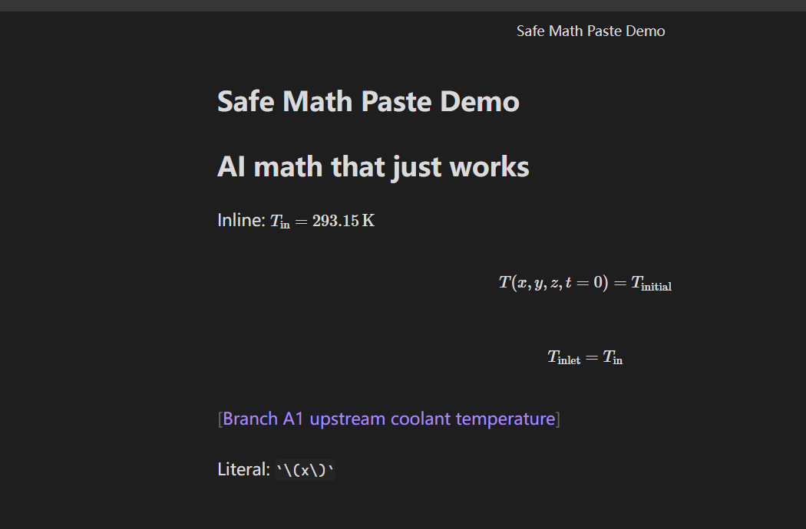

# Safe Math Paste

Safe Math Paste is an offline Obsidian plugin that automatically repairs LaTeX math delimiters while text is pasted from AI assistants such as Codex, ChatGPT, and Claude.

AI responses commonly use `\\(...\\)` for inline math and `\\[...\\]` for display math, while Obsidian expects `$...$` and `$$...$$`. Rich-text copying can also strip the backslashes and leave a formula inside plain `[ ... ]` brackets. Safe Math Paste fixes these formats at the Obsidian boundary without changing how the source assistant writes or renders its response.



## Features

- Converts `\\(...\\)` to `$...$` automatically on paste.
- Converts `\\[...\\]` to `$$...$$` automatically on paste.
- Conservatively repairs standalone `[ ... ]` formulas when strong LaTeX signals are present.
- Preserves fenced code blocks, inline code, existing dollar-delimited math, and ordinary bracketed prose.
- Provides a one-time bypass command for content that should be pasted unchanged.
- Can convert only the selected text on demand.
- Runs locally without network requests, telemetry, or vault-wide scanning.

## Example

| Clipboard input | Inserted Obsidian Markdown |
| --- | --- |
| `\\(x=1\\)` | `$x=1$` |
| `\\[x=1\\]` | `$$x=1$$` |
| `[ T_{\\mathrm{inlet}}=T_{\\mathrm{in}} ]` | A `$$...$$` display block |
| `[Branch A1 upstream temperature]` | Unchanged |
| `` `\\(literal\\)` `` | Unchanged |

## Commands

- **Toggle automatic math conversion**
- **Skip conversion for next paste**
- **Convert math in selected text**

## Settings

- **Convert math on paste** enables or disables automatic conversion.
- **Repair stripped display brackets** controls conservative `[ ... ]` repair.
- **Show conversion notice** displays a short notice after a paste is changed.

## Beta installation with BRAT

Until Safe Math Paste is listed in the Obsidian Community directory, you can install it with [BRAT](https://github.com/TfTHacker/obsidian42-brat):

1. Install and enable BRAT from **Settings → Community plugins**.
2. Run **BRAT: Add a beta plugin for testing** from the command palette.
3. Enter `Yuming12138/safe-math-paste`.
4. If BRAT shows a version selector, choose `1.0.0 (Prerelease)`.
5. Enable **Safe Math Paste** in **Settings → Community plugins**.

## Manual installation

Download `main.js`, `manifest.json`, and `styles.css` from the latest [GitHub release](https://github.com/Yuming12138/safe-math-paste/releases). Copy them into:

```text
<Vault>/.obsidian/plugins/safe-math-paste/
```

Reload Obsidian, then enable **Safe Math Paste** under **Settings → Community plugins**.

## Known limitations

- Bare `[ ... ]` repair is intentionally conservative. Ambiguous bracketed expressions are left unchanged.
- Automatic conversion uses the plain-text clipboard representation. Rich formatting from the same paste is not preserved when a conversion occurs.
- Mobile support is intended but should be considered beta until it has been tested on physical iOS and Android devices.

## Privacy

Safe Math Paste runs entirely inside Obsidian. It does not make network requests, collect analytics, scan the vault, or retain clipboard contents. Only the text involved in the current paste or selected-text command is processed in memory.

## Development

Requirements: Node.js 18 or later and npm.

```powershell
npm install
npm run check
```

The production build creates `main.js` in the project root. Release tags must match the version in `manifest.json` and include `main.js`, `manifest.json`, and `styles.css` as individual assets.

## Contributing

Bug reports and focused pull requests are welcome. See [CONTRIBUTING.md](CONTRIBUTING.md) for the development and testing workflow.

## License

[MIT](LICENSE)
